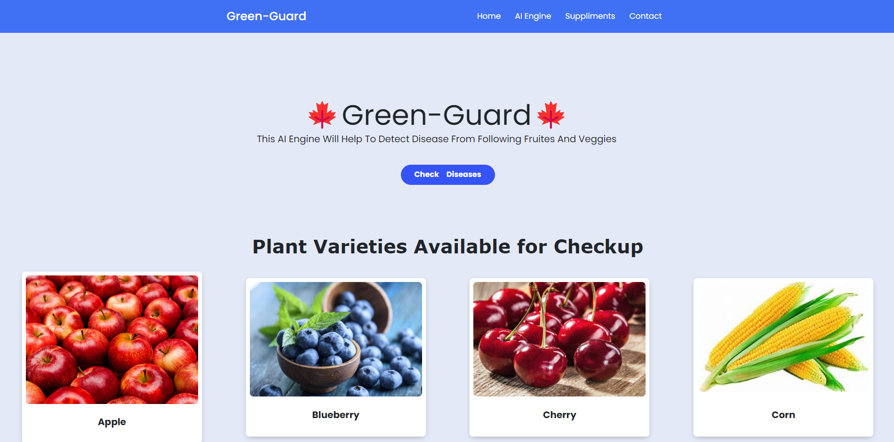
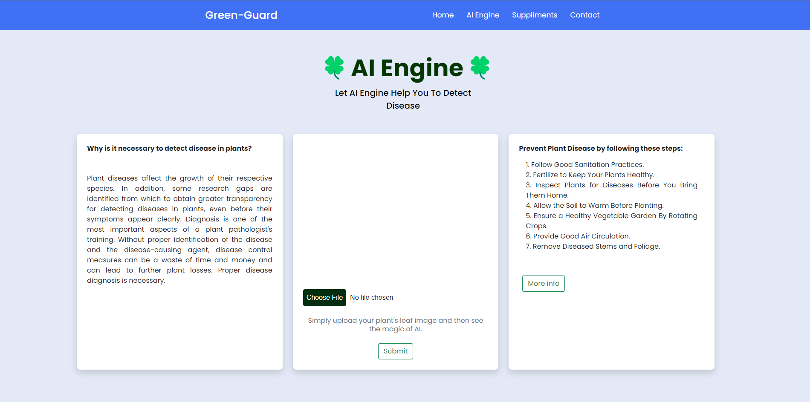
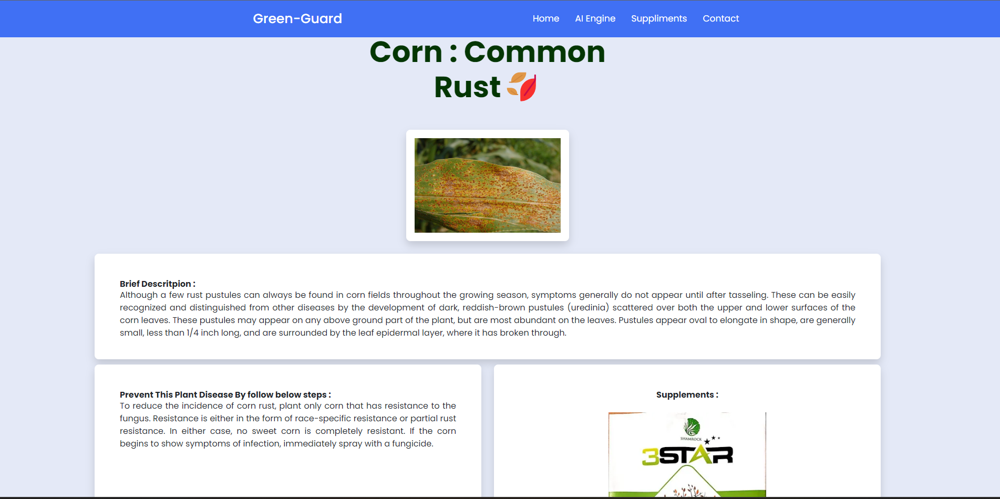
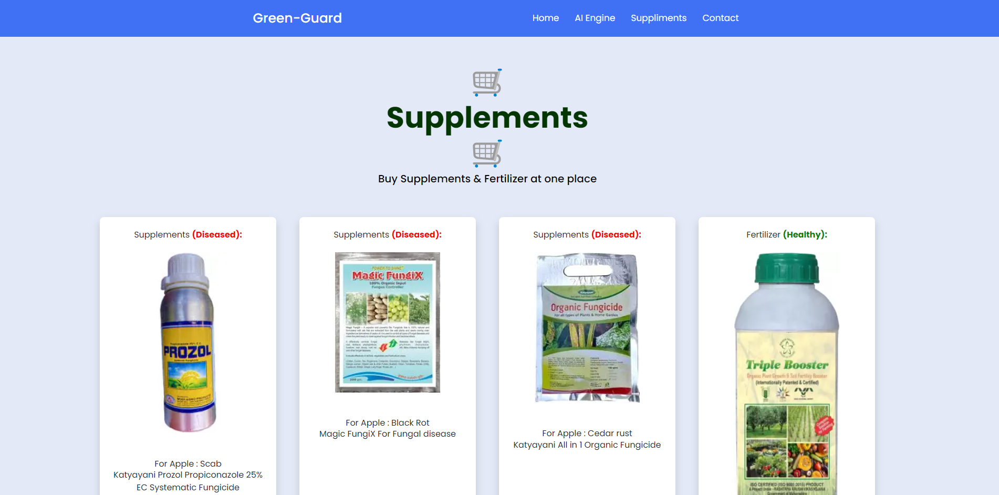

# ⭐ Green-Gaurd

Plant disease detection is crucial for every farmer. This project utilizes Deep Learning to classify leaf images into 39 different categories using Convolutional Neural Networks (CNN) built with PyTorch. The training data is sourced from the Plant Village dataset.

---

## ⭐ Run the Project on Your Machine

1. **Python Version:**
   - Ensure **Python 3.8** is installed on your machine.

2. **Setup Virtual Environment:**
   - Create and activate a Python Virtual Environment.

3. **Install Dependencies:**
   - Run the command:
     ```bash
     pip install -r requirements.txt
     ```

4. **Project Directory:**
   - Navigate to the `Flask Deployed App` folder.


5. **Run Flask App:**
   - Execute the command:
     ```bash
     python3 app.py
     ```
---


## ⭐ Testing Images

If you lack leaf images, use the test images located in the `test_images` folder. Each image includes its corresponding disease name for model verification.

---


## ⭐ Snippets of the Web App:

#### Main Page


#### AI Engine


#### Results Page


#### Supplements/Fertilizer Store


#### Contact Us


